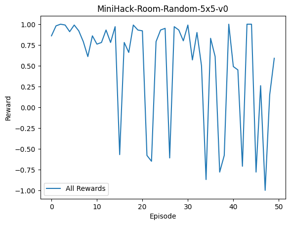
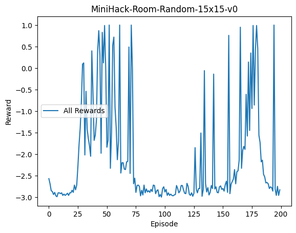
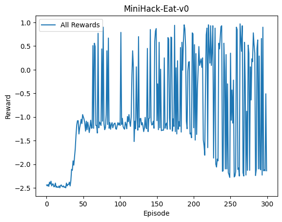
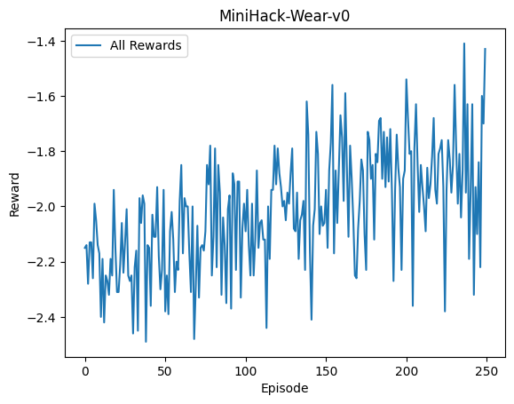
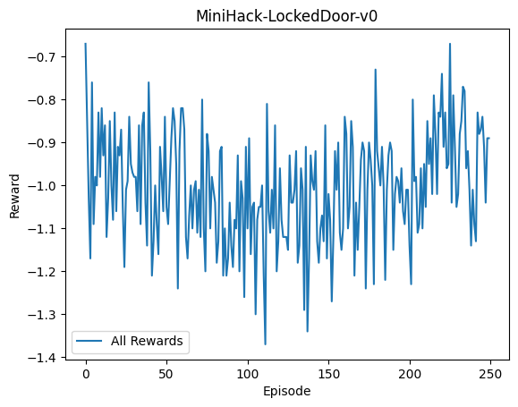

<h1>Minihack Reinformcent Learning Project</h1>
<h2>Reinformcemnt Learning task to train an agent to navigate the Minihack-Quest-hard envrionment</h2>

The goal of this project is to compare the accuracy of different algorithms in navigating the Minihack-Quest-hard envrionment. The two algorithms used here are the Deep Q-Network (DQN) and the Actor-Critic model, an implmentation of a policy gradient method.

For both algorithms the general methodology was as follows
Train the agent on skill acquisation tasks whereby the agent learns certain skills thay will help it navigate the Minihack-Quest-hard envrionment.
Once learned, the agent will attempt to navigate the quest easy and medium environments before attempting the hard environment.

<h2>DQN</h2>

Deep Q-Networks, a fundamental network architecture of current Reinforcement Learning algorithms allows for neural networks to capture the environments state representation and approximate state-actions values. This capability enables the use of convolutional neural networks to capture semantic information of a single frame or a sequence of frames. As shown in the original DQN paper, DQN’s have the capacity to perform well in game environments as seen in DQN Atari games. Considering the MiniHack-Quest environments poses a similar game-like environment to that of Atari games, applying a DQN structure to such environments would offer valuable insights and potentials for a trained agent. Extracting MiniHack frames was done through the ‘pixel’ observation.

As MiniHack-Quest environments bring many challenging tasks to the agent, building a foundational understanding of the DQN capabilities on progressing harder tasks will help benchmark the DQN agent. As such, the action space was kept to the bare needed actions for each environment. It was also decided that the DQN will only be fed in one frame instead of a sequence of frames due to the simple benchmark environments being relatively simple and maintained a relative Markov property. The DQN structure was set up to be that of the original DQN Atari paper

<h2>Actor-Critic</h2>

The Actor-Critic model was implemented. This method follows the approach whereby the actor part of the algorithm chooses the actions to take (the policy) and the critic evaluates the performance of the actor. Each has its own set of weights that are trained to optimize their task.

Policy gradient methods (the actor) make updates to the probability distribution of actions to take whereby the actions with a higher expected reward will have a higher probability value for a state observation. The objective for the actor is to learn a policy that maximizes the cumulative future reward from any given time 't' until the run ends at a terminal time 'T'.

The objective of the critic is to evaluate the policy. It does so by constructing its value function or action-value function. In this case, the action-value (Q-value) was used. Both the actor and critic are initialized with a neural network, each with their own weights.

<h2>Results</h2>
<h3>Actor-Critic</h3>
<h4>Skill Acquisitions</h4>

<h3>DQN</h3>

 MiniHack-Room-5x5-v0 episode Return
 

 MiniHack-Room-Random-5x5-v0 episode Return

 MiniHack-Quest-Easy-v0 episode Return

 MiniHack-Quest-Medium-v0 episode Return

